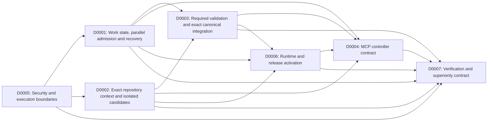

# dev-2 Design index

Generated from Design metadata by `python docs/design/check.py --write-index`. Do not edit owned values here.
This is navigation only. IDs are identities, not priority or execution sequence. WORKBOARD owns execution order.

| ID | Title | Status | Depends-On | Supersedes |
| --- | --- | --- | --- | --- |
| [D0001](D0001-work-state-parallel-recovery.md) | Work state, parallel admission and recovery | accepted | [D0005] | [] |
| [D0002](D0002-repository-context-candidates.md) | Exact repository context and isolated candidates | accepted | [D0005] | [] |
| [D0003](D0003-validation-exact-integration.md) | Required validation and exact canonical integration | accepted | [D0001, D0002] | [] |
| [D0004](D0004-mcp-controller-contract.md) | MCP controller contract | accepted | [D0001, D0002, D0003, D0006] | [] |
| [D0005](D0005-security-execution-boundaries.md) | Security and execution boundaries | accepted | [] | [] |
| [D0006](D0006-runtime-release-activation.md) | Runtime and release activation | accepted | [D0001, D0002, D0003] | [] |
| [D0007](D0007-verification-superiority-contract.md) | Verification and superiority contract | accepted | [D0001, D0002, D0003, D0004, D0005, D0006] | [] |

## Semantic dependency graph

Arrow means prerequisite decision -> dependent decision, not a work schedule.

## Ownership projection

| Design | Bounded decisions |
| --- | --- |
| D0001 | work-state, action-deduplication, parallel-admission, execution-recovery |
| D0002 | repository-snapshots, progressive-context, candidate-generations |
| D0003 | validation-identity, canonical-integration, stale-conflict-semantics |
| D0004 | public-mcp-schema, controller-recipes, observation-contract |
| D0005 | authorization, sandbox-boundary, credential-custody |
| D0006 | runtime-topology, release-activation, toolchain-seal |
| D0007 | test-environments, benchmark-methodology, superiority-gates |
